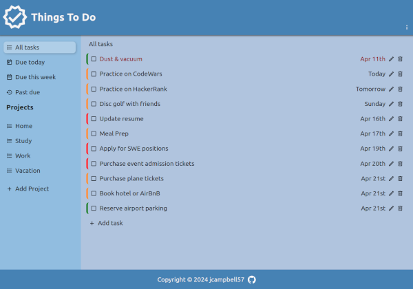
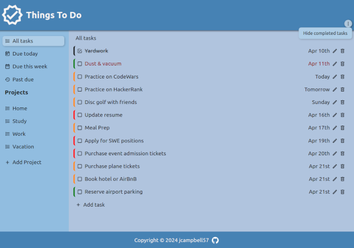
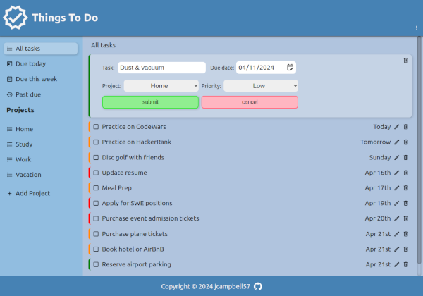
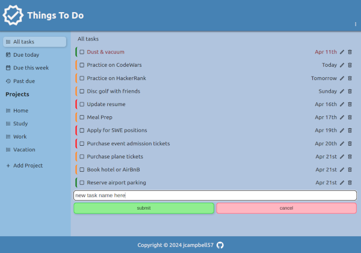
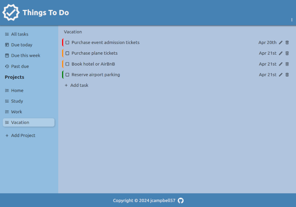
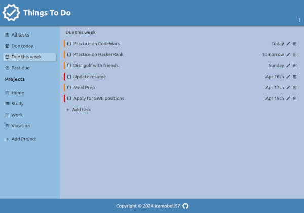

# Things To Do

## Project info

A simple to-do list application. The purpose of this project is to practice serialization with JSON and object oriented programming.

Project description can be found [here](https://www.theodinproject.com/lessons/javascript-todo-list)

## Live demo

Live demo available [here](https://jcampbell57.github.io/odin-todo-list)

## Table of Contents

* [Features](#features)
* [Technologies utilized](#technologies-utilized)
* [Learning outcomes](#learning-outcomes)
* [Project screenshots](#project-screenshots)
* [Behind the Scenes](#behind-the-scenes)
* [Installation](#installation)

## Features

- CRUD functionality for tasks and projects
- localStorage integration
- Task filtering by:
  - date
  - project
  - completed status

## Technologies utilized

- HTML5
- CSS3
- JavaScript ES6
- JSON
- webpack

## Learning outcomes

This project helped to reinforce the following skills:

- webpack
- JSON
- serialization
- localStorage integration
- JavaScript modules
- DOM manipulation
- CSS styling

## Project screenshots

### All tasks:

 

### Completed tasks filter:

 

### Edit task:

 

### New project input:

 

### New task input:

 

### Project sort:

 

### Weekly sort:

 

## Behind the scenes

### Improvements

This project could be improved with:

- Responsive design for mobile or tablet use
- option to sort by priority instead of date
- search bar to filter tasks by input
- drag and drop functionality
- Theme toggle

### Resources

- [CSS reset](https://meyerweb.com/eric/tools/css/reset/)
- [date-fns](https://date-fns.org/) library
- [This resource](https://gist.github.com/cobyism/4730490) is helpful when deploying to gh-pages after webpack is run.

## Installation

- Clone this repository to your desktop.
- Navigate to the top level of the directory by running `cd odin-todo-list`.
- Run `npm install` to install the required dependencies.  
- Open `dist/index.html` in your browser.
- Run `npm run watch` to update the `dist` folder on save
- Refresh page after saving to see changes
